<div align="center">

# 🎵 MixLoop
### *Audio Sequence Mixer*


**Aplikasi web minimalist untuk menggabungkan multiple audio files menjadi sequence seamless dengan crossfade transitions dan audio enhancement.**

---

### 🚀 **Developed by [BITZY.ID](https://e.bitzy.id)**


</div>

---

## ✨ **Features**

<div align="center">

| 🎵 **Sequential Processing** | 🔄 **Seamless Looping** | ✨ **Audio Enhancement** |
|:---:|:---:|:---:|
| Menggabungkan audio berurutan<br>`audio1→audio2→audio3`<br>*(bukan overlay)* | Loop dengan crossfade<br>di boundaries untuk<br>hasil seamless | Filter untuk meningkatkan<br>kualitas audio dengan<br>normalisasi loudness |

| 📱 **Mobile-First UI** | 🎛️ **Drag & Drop** | 📤 **Multiple Formats** |
|:---:|:---:|:---:|
| Responsive design<br>terinspirasi Threads<br>by Instagram | Interface modern<br>untuk upload files<br>dengan ease | Export dalam<br>MP3 320k dan<br>WAV 24-bit |

</div>

---

## 🛠️ **Tech Stack**

<div align="center">

### **Backend Architecture**
```
┌─────────────────┐    ┌─────────────────┐    ┌─────────────────┐
│   Gorilla Mux   │───▶│     FFmpeg      │───▶│  Audio Output   │
│     Router      │    │   Processing    │    │   MP3/WAV      │
└─────────────────┘    └─────────────────┘    └─────────────────┘
```

### **Frontend Stack**
```
┌─────────────────┐    ┌─────────────────┐    ┌─────────────────┐
│   React 18 +    │───▶│   TailwindCSS   │───▶│  Glass Morphism │
│      Vite       │    │    Styling      │    │       UI        │
└─────────────────┘    └─────────────────┘    └─────────────────┘
```

</div>

---

## 🚀 **Quick Start**

<div align="center">

### **Prerequisites**


</div>

### **Installation Steps**

<details>
<summary><b>🔧 Step 1: Install FFmpeg</b></summary>

```bash
# Ubuntu/Debian
sudo apt install ffmpeg

# macOS
brew install ffmpeg

# Windows
# Download from https://ffmpeg.org/download.html
```
</details>

<details>
<summary><b>⚙️ Step 2: Backend Setup</b></summary>

```bash
cd backend
go mod tidy
go run main.go
```
**Server akan berjalan di:** `http://localhost:8081`
</details>

<details>
<summary><b>🎨 Step 3: Frontend Setup</b></summary>

```bash
cd frontend
npm install
npm start
```
**Frontend akan berjalan di:** `http://localhost:3000`
</details>

---

## 🎛️ **Audio Processing Pipeline**

```mermaid
graph LR
    A[📁 Upload Files] --> B[✅ Validation]
    B --> C[🔗 Sequence Creation]
    C --> D[🔄 Loop Application]
    D --> E[✨ Enhancement]
    E --> F[📤 Export MP3/WAV]
    
    style A fill:#e1f5fe
    style B fill:#f3e5f5
    style C fill:#e8f5e8
    style D fill:#fff3e0
    style E fill:#fce4ec
    style F fill:#e0f2f1
```

<div align="center">



</div>

### **Enhancement Filters Applied**

| Filter | Purpose | Settings |
|:---:|:---:|:---:|
| 🔊 **Loudness Norm** | Normalisasi volume | `I=-14:TP=-2:LRA=11` |
| 🎚️ **High Pass** | Remove low hum | `f=80Hz` |
| 🎛️ **Low Pass** | Remove ultrasonic noise | `f=16000Hz` |
| 🎵 **Compressor** | Stabilkan dinamika | `threshold=-20dB:ratio=3` |

---

## 📡 **API Reference**

<div align="center">

### **Endpoint: `/mix`**


</div>

**Example Request:**
```bash
curl -X POST http://localhost:8081/mix \
  -F "audio=@tone1.mp3" \
  -F "audio=@tone2.mp3" \
  -F "audio=@tone3.mp3" \
  -F "loops=2" \
  -F "crossfade=1.5" \
  -F "enhance=true" \
  -F "format=mp3" \
  -o mixloop_output.mp3
```

**Parameters:**
| Parameter | Type | Default | Description |
|:---:|:---:|:---:|:---:|
| `audio` | files | - | Multiple audio files (MP3/WAV) |
| `loops` | int | `1` | Jumlah pengulangan |
| `crossfade` | float | `2.0` | Durasi crossfade (detik) |
| `enhance` | bool | `true` | Enable audio enhancement |
| `format` | string | `mp3` | Output format (`mp3`/`wav`) |

---

## 📁 **Project Structure**

```
mixloop/
├── 📂 backend/                 # 🐹 Golang API Server
│   ├── 📂 handlers/           #    HTTP request handlers
│   ├── 📂 utils/              #    Audio processing modules
│   ├── 📄 main.go             #    Server entry point
│   └── 📄 go.mod              #    Go dependencies
├── 📂 frontend/               # ⚛️ React Application
│   ├── 📂 src/                #    Source code
│   │   ├── 📂 components/     #    React components
│   │   └── 📄 main.jsx        #    App entry point
│   ├── 📂 public/             #    Static assets
│   └── 📄 package.json        #    NPM dependencies
├── 📂 test_audio/             # 🎵 Sample audio files
├── 📄 README.md               # 📖 This file
└── 📄 API_DOCUMENTATION.md    # 📚 API reference
```

---

## 🎯 **Demo & Usage**

<div align="center">

### **Live Demo**
[](http://localhost:3000)

### **Sample Audio Files**
Gunakan file audio di folder `test_audio/` untuk testing:
- `tone1_440hz.mp3` - 440Hz tone (3 detik)
- `tone2_880hz.mp3` - 880Hz tone (3 detik)  
- `tone3_1320hz.mp3` - 1320Hz tone (3 detik)

**Expected Result:** 9 detik audio sequence (bukan 3 detik overlay)

</div>

---

## 🤝 **Contributing**

<div align="center">

[](https://github.com/bicknicktick/mixloop/graphs/contributors)
[](https://github.com/bicknicktick/mixloop/issues)
[](https://github.com/bicknicktick/mixloop/pulls)

**Contributions are welcome!** 

1. Fork the repository
2. Create feature branch (`git checkout -b feature/AmazingFeature`)
3. Commit changes (`git commit -m 'Add AmazingFeature'`)
4. Push to branch (`git push origin feature/AmazingFeature`)
5. Open Pull Request

</div>

---

## 📄 **License**

<div align="center">

[](LICENSE)

**MIT License** - Feel free to use this project for personal and commercial purposes.

</div>

---

<div align="center">

### 💝 **Made with ❤️ by [BITZY.ID](https://e.bitzy.id)**

[](https://bitzy.id)
[](https://github.com/bicknicktick)

**⭐ Star this repo if you find it useful!**

</div>
